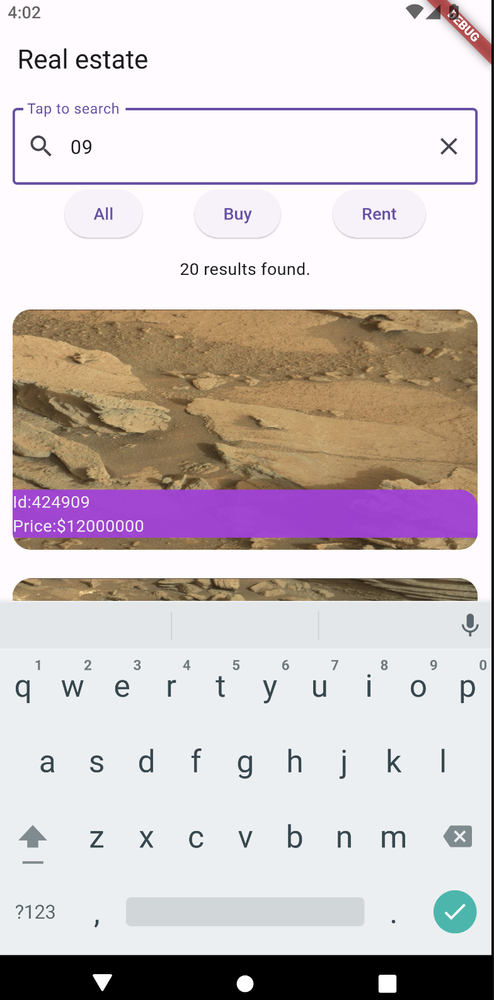

# App Real Estate Mars

App para practicar:
 - Manejo de estados con BLoC
 - Mapeo estados y eventos
 - Requests HTTP
 - Serializacion de JSON 
 - Busqueda en listas tiempo real

## Getting Started

Recuerda que despues de clonar el proyecto, abrir una terminal dentro de la carpeta del proyecto y ejecutar el comando:

```sh
flutter packages get
``` 

## App Screenshot





Original app extracted from Get data from the internet Android developers code lab
https://developer.android.com/codelabs/basic-android-kotlin-compose-getting-data-internet#1 